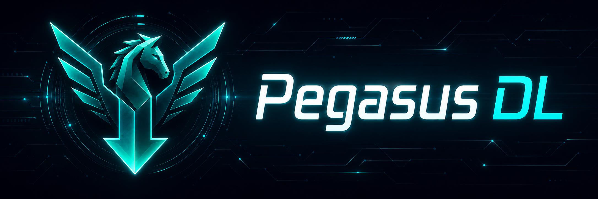

<p align="center">
  
</p>

<p align="center">
  <a href="https://github.com/pegasus-ps5/pegasus-dl/releases/tag/v1.1.0"></a>
  <a href="https://github.com/pegasus-ps5/pegasus-dl/releases/download/v1.1.0/pegasus_dl.elf"></a>
  
  
</p>

<p align="center">
  Direct package downloading from your PS5, managed through a local web interface.
</p>

---

## Overview

Pegasus DL runs as a payload on the console and serves a browser interface on
your local network. Add catalog sources, browse the combined library, choose a
download destination, queue packages, and follow progress from a phone, tablet,
or computer.

It is designed to keep the download workflow on the PS5 instead of routing
packages through another machine first.

Version 1.1.0 moves provider handling into the payload. Direct package links
still queue immediately, while supported provider pages can be resolved or
captured through the PS5 browser without running a separate resolver service.

## Demo


## Download

| Release | Version |
| --- | --- |
| [`pegasus_dl.elf`](https://github.com/pegasus-ps5/pegasus-dl/releases/download/v1.1.0/pegasus_dl.elf) | `1.1.0` |

## Quick Start

1. Download the release asset above.
2. Send it to your PS5 with your usual payload loader.
3. Open Pegasus DL from a device on the same network.

   ```text
   http://<your-ps5-ip>:6970/
   ```

4. Choose a writable download folder in Settings.
5. Add a catalog source by upload or URL.
6. Search the library, select a package, and queue the download.
7. If a link opens a provider page, follow the PS5 browser flow until Pegasus
   captures or resolves the final download.

## Features

| Area | Included in 1.1.0 |
| --- | --- |
| Sources | Add catalog files or URL sources, enable or disable sources, delete sources |
| Library | Search packages, filter by source, review versions, sizes, details, and links |
| Downloads | Queue direct links, track progress, speed, ETA, and final status |
| Queue control | Pause, resume, cancel, retry, and clear finished jobs |
| Storage | Browse writable destinations, create folders, and choose where downloads land |
| Performance | Use multiple download connections with resume support when the host allows it |
| Logs | View payload messages and browser-side errors from the Logs tab |
| Provider links | Resolve supported providers inside the payload, or use PS5 browser-assisted capture for compatible provider pages |

## Catalogs

Pegasus DL does not ship with catalogs or package links. Bring catalog sources
you trust and are allowed to use.

Required package fields:

| Field | Purpose |
| --- | --- |
| `titleId` | Package identifier shown in the library |
| `title` | Package name |
| `downloadLinks[].url` | At least one valid direct download URL |

Common optional fields:

| Field | Purpose |
| --- | --- |
| `version` | Package version shown beside the title |
| `posterUrl` | Cover or poster image |
| `description` | Notes shown in the detail view |
| `downloadSource` | Original source page |
| `sizeBytes` | Estimated package size |

Minimal catalog:

```json
{
  "name": "My Catalog",
  "packages": [
    {
      "titleId": "ABCD12345",
      "title": "Example Package",
      "version": "1.00",
      "downloadLinks": [
        {
          "name": "Mirror",
          "url": "https://example.com/downloads/example-package"
        }
      ]
    }
  ]
}
```

## Provider Links

Pegasus DL does not require the separate Pegasus Resolver service in 1.1.0.
Provider handling now lives in the payload.

Direct links continue to download without any provider flow. For supported
provider pages, Pegasus can open the PS5 browser, watch for the final direct
download URL through a helper payload, validate the result, and queue it.

Current provider handling:

| Provider state | Behavior |
| --- | --- |
| Built-in resolver | BuzzHeavier, DataNodes, and MediaFire can resolve direct package links from inside Pegasus DL |
| Browser-assisted | VikingFile and Rootz use the PS5 browser capture flow |
| Unknown | Pegasus can try guarded browser capture and queue the URL only after response validation |
| Not supported | The link can still be opened in the PS5 browser, but Pegasus will not queue from it automatically |

## 1.1.0 Notes

- External Pegasus Resolver setup is no longer required.
- Catalog sources by URL is supported.
- Provider handling covers built-in resolver flows, direct browser capture, and
  guarded capture for unknown links.
- The PS5 browser may be opened during provider flows. Complete any provider
  challenge there (eg. Cloudflare), then return Pegasus DL will capture the direct link automatically.

## Scope

Pegasus DL is a downloader. It does not install packages, include package
catalogs, provide package links, bypass accounts, spoof PSN, bypass anti-cheat,
or unlock content.

Use it only with content you own or have permission to download.
