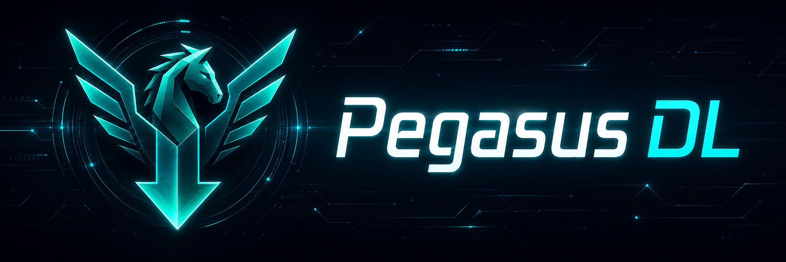

<p align="center">
  
</p>

<p align="center">
  <a href="https://github.com/pegasus-ps5/pegasus-dl/releases/tag/v1.7.0"></a>
  <a href="https://github.com/pegasus-ps5/pegasus-dl/releases/download/v1.7.0/pegasus_dl.elf"></a>
  
  
</p>

<p align="center">
  Direct package downloading from your PS5, managed through a local web interface.
</p>

---

## Overview

Pegasus DL runs as a payload on the console and serves a browser interface on
your local network. Add catalog sources, browse the combined Store catalog,
choose a download destination, queue packages, and follow progress from a phone,
tablet, or computer.

It is designed to keep the download workflow on the PS5 instead of routing
packages through another machine first.

Version 1.7.0 adds TorBox queueing, manual link downloads, URL source refresh,
and tighter handling for provider captures and download sockets.

## Demo


## Download

| Release | Version |
| --- | --- |
| [`pegasus_dl.elf`](https://github.com/pegasus-ps5/pegasus-dl/releases/download/v1.7.0/pegasus_dl.elf) | `1.7.0` |

## Quick Start

1. Download the release asset above.
2. Send it to your PS5 with your usual payload loader.
3. Open Pegasus DL from a device on the same network.

   ```text
   http://<your-ps5-ip>:6970/
   ```

4. Choose a writable download folder in Settings.
5. Add a catalog source by upload or URL.
6. Search the Store catalog, select a package, and queue the download.
7. If a link opens a provider page, follow the PS5 browser flow until Pegasus
   captures or resolves the final download.
8. Use the Library tab to review installed games, update APR Emu where
   supported, or delete recognized installs.
9. Use the File Manager tab to browse storage, transfer files, or install a
   local `.pkg` when needed.

## Features

| Area | Included in 1.7.0 |
| --- | --- |
| Sources | Add catalog files or URL sources, refresh URL sources, enable or disable sources, delete sources |
| Store catalog | Search packages, filter by source, review versions, sizes, details, and links |
| Installed Library | List installed games with app database metadata, art, storage details, APR Emu status, update actions, and supported deletion |
| Downloads | Queue catalog links, manual links, direct or resolved links, track download, merge, extraction, finalization, speed, ETA, and final status |
| Archives | Detect supported single-file `.rar`, RAR5, and `.7z` links, extract automatically, prompt for RAR passwords, and reject split archives |
| Queue control | Pause, resume, cancel, retry, and clear finished jobs |
| Storage | Browse writable destinations, create folders, and choose where downloads land |
| File Manager | Browse mounted storage, upload and download files, copy, move, rename, delete, archive folders, extract RAR files, use mount shortcuts, and install local `.pkg` files |
| Performance | Use multiple download connections with resume support when the host allows it |
| Logs | View payload messages and browser-side errors from the Logs tab |
| Provider links | Resolve supported providers inside the payload, or use PS5 browser-assisted capture for compatible provider pages |
| Debrid services | Save local Real-Debrid and TorBox API tokens, validate supported hosts, badge compatible links, choose returned files, and queue resolved downloads |
| APR Emu | Detect, update, and reinstall remote APR Emu releases for supported folder-backed and image-backed installs |
| nanoDNS | nanoDNS is now embedded inside Pegasus DL and autostarts on launch |

## Catalogs

Pegasus DL does not ship with catalogs or package links. Bring catalog sources
you trust and are allowed to use.

Required package fields:

| Field | Purpose |
| --- | --- |
| `titleId` | Package identifier shown in the Store catalog |
| `title` | Package name |
| `downloadLinks[].url` | At least one valid direct download URL |

Common optional fields:

| Field | Purpose |
| --- | --- |
| `version` | Package version shown beside the title |
| `posterUrl` | Cover or poster image |
| `description` | Notes shown in the detail view |
| `downloadSource` | Original source page |
| `sizeBytes` | Estimated package size |

Minimal catalog:

```json
{
  "name": "My Catalog",
  "packages": [
    {
      "titleId": "ABCD12345",
      "title": "Example Package",
      "version": "1.00",
      "downloadLinks": [
        {
          "name": "Mirror",
          "url": "https://example.com/downloads/example-package"
        }
      ]
    }
  ]
}
```

## Archive Downloads

Pegasus DL recognizes supported archive links before queueing them. A
single-file `.rar`, RAR5, or `.7z` download is extracted into the selected
destination automatically instead of leaving the archive file behind.

Archive jobs show extraction and finalization progress in the queue. RAR/RAR5
jobs can pause for a password when needed. 7z archives use HTTP range reads when
seeking is required, so the host must support byte ranges; password-protected
7z files are detected but not extracted yet.

Split archives such as `.part1.rar`, `.r00`, and `.7z.001` are rejected. During
finalization, Pegasus unwraps simple outer folders when the extracted content
contains a direct game folder with `EBOOT.BIN` or `sce_sys/param.sfo`.

## Installed Library

The Library tab reads installed titles from the PS5 app database and shows game
metadata, art when available, backing storage type, location, image-backed size,
and APR Emu state.

APR Emu versions are fetched from this public repo at runtime. The Library can
update supported installs to the latest remote release or reinstall a selected
release/debug build after verifying the downloaded SPRX hash. Folder-backed
games and supported `.exfat`, `.ffpkg`, and `.ffpfsc` image-backed games are
patched by replacing `fakelib/libSceAmpr.sprx`; raw `.ffpfs` remains unsupported
for APR mutation.

The Library can also delete recognized installed games. Deletion is
irreversible: Pegasus removes the resolved backing image or folder, cleans the
title trackers when present, and removes the app database rows for that title.
Large recursive folder deletes now run through a cancellable background worker
so the UI stays responsive while cleanup progresses.

## File Manager

The File Manager tab browses PS5 storage from the web UI. It supports browser
uploads, single-file downloads, folder archive downloads, rename, copy, move,
delete, and new folder creation. `.pkg` files can be handed to the native PS5
installer from the file list.

## Provider Links

Pegasus DL does not require the separate Pegasus Resolver service.
Provider handling now lives in the payload.

Direct links continue to download without any provider flow. For supported
provider pages, Pegasus can open the PS5 browser, watch for the final direct
download URL through a helper payload, validate the result, and queue it.
Pegasus also embeds nanoDNS 0.3 and starts it when browser-assisted capture
needs the helper and `nanodns.elf` is not already running.

Current provider handling:

| Provider state | Behavior |
| --- | --- |
| Built-in resolver | BuzzHeavier, DataNodes, and MediaFire can resolve direct package links from inside Pegasus DL |
| Debrid services | Links from supported hosts can resolve through Real-Debrid or TorBox and queue through the normal downloader when a token is configured |
| Browser-assisted | Filek, VikingFile, and Rootz use the PS5 browser capture flow |
| Unknown | Pegasus can try guarded browser capture and queue the URL only after response validation |
| Not supported | The link can still be opened in the PS5 browser, but Pegasus will not queue from it automatically |

## 1.7.0 Notes

- Added TorBox support with local token storage, supported-host detection,
  service selection when multiple debrid providers match, multi-file selection,
  and queueing through the normal downloader.
- Added manual link downloads so a direct URL can be named and queued without a
  catalog entry.
- URL sources can now be refreshed in place, and enabled URL sources refresh
  automatically from the backend.
- Improved provider capture by detecting download file extensions more reliably
  and tuning PS5 curl socket behavior during downloads.
- Refined Store artwork sizing, equal-height grid rows, and the settings panels
  for download and debrid controls.

## Scope

Pegasus DL is a downloader and local file-management tool. It does not include
package catalogs, provide package links, bypass accounts, spoof PSN, bypass
anti-cheat, or unlock content.

Use it only with content you own or have permission to download.
